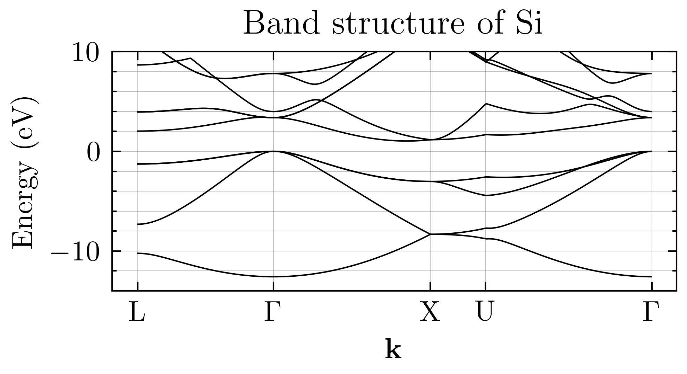

# EmpiricalPseudopotential
Band structure computation using empirical pseudopotentials

This repository was initially a fork from : [EmpiricalPseudopotential](https://github.com/aromanro/EmpiricalPseudopotential) of [Adrian Roman](https://compphys.go.ro/empirical-pseudopotential/).

---

## Features
You can do two types of calculations:
* Compute the electronic band structure over a path of high-symmetry points (e.g. $L\Gamma X U K \Gamma$) for a given material, and plot the results :  

---

* Compute the electronic band structure over all k-points of an input mesh of the Brillouin Zone (or a fraction of it). The result can then be visualized, for example, through iso-energy surface:

---

## Compilation
### Dependencies  
This project relies on these libraries:
* [Eigen](https://eigen.tuxfamily.org)
* [GMSH](https://gmsh.info/)
* [OpenMP](https://www.openmp.org/)
* [tclap](http://tclap.sourceforge.net/)

You will also need standard packages such as CMake, Make, a C++ compiler, etc.
A __minimal installation__ command would look like:  
`sudo apt-get update && sudo apt-get install -y apt-utils cmake g++ libopenmpi-dev`  

If you don't have __Eigen__ install on your system, the sources will be automatically fetched by CMake when you'll compile the project. You don't need to do anything. [Eigen Website](https://eigen.tuxfamily.org).

The __tclap__ library is headers-only and embedded in the sources of the project.
You do not need to install it. 

You can install __GMSH__ from sources straightforwardly :   
Go wherever you want to install the library and run:   
`git clone https://gitlab.onelab.info/gmsh/gmsh.git && cd gmsh && mkdir build && cd build && cmake -DCMAKE_BUILD_TYPE=Release -DENABLE_BUILD_SHARED=1 -DENABLE_PRIVATE_API=1 .. && make -j 8 shared && make install/fast && cd .. && rm -rf gmsh `  
Find more informations on [GMSH Website](https://gmsh.info/).

### Compilation  
1. `git clone https://github.com/RemiHelleboid/EmpiricalPseudopotential.git`
2. `cd EmpiricalPseudopotential`
3. `mkdir build && cd build`
4. `cmake ..`
5. `make`
   
---
## Usage

## Available Material

